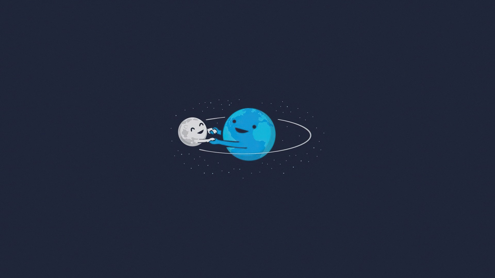

## Описание

WEB-приложение с использованием [NASA API](https://api.nasa.gov/) 

## Использованные технологии 

- [React.js](https://ru.reactjs.org/)
- [React-calendar](https://github.com/wojtekmaj/react-calendar)
- [React-lazy-load-image-component](https://github.com/Aljullu/react-lazy-load-image-component)
- [Redux](https://github.com/wojtekmaj/react-calendar)
- [React-redux](https://github.com/reduxjs/react-redux)
- [Redux-thunk](https://github.com/reduxjs/redux-thunk)

## Авторы

Разработчик - [Шавловский Иван Валентинович](https://vk.com/shavlovsky98).

